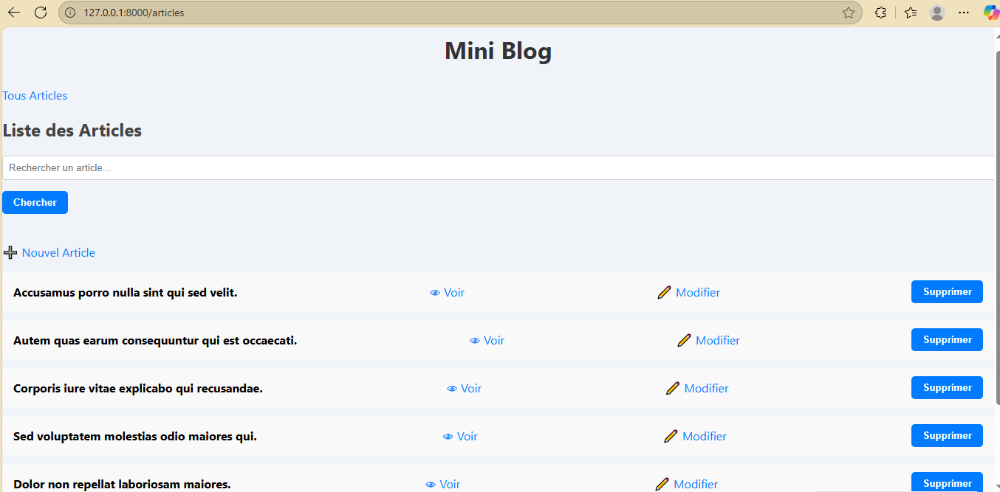
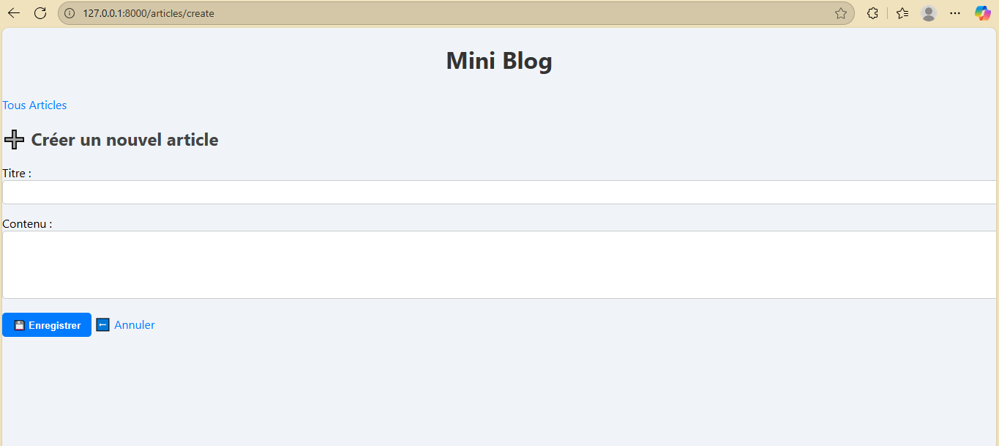
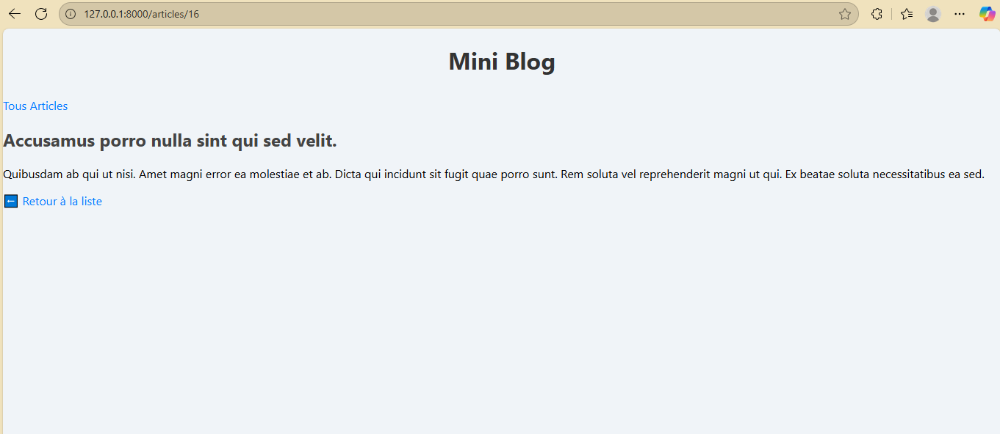
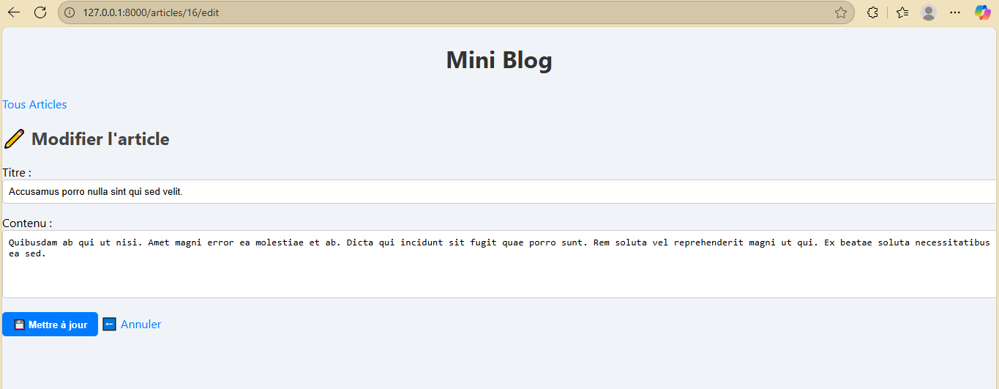

Mini Blog – Laravel Project
Description

Mini Blog est une application web simple développée avec Laravel, permettant de gérer des articles avec les fonctionnalités classiques CRUD (Create, Read, Update, Delete).

Le projet inclut également pagination, recherche par titre, et flash messages pour indiquer les actions réussies ou les erreurs.

Le design est moderne avec des boutons colorés et bien organisés pour une meilleure expérience utilisateur.

- Fonctionnalités :

Liste des articles avec pagination (5 articles par page)

Créer un nouvel article

Modifier un article existant

Supprimer un article avec confirmation

Afficher les détails d’un article

Recherche simple par titre

Flash messages pour les notifications de succès ou d’erreur

Design moderne avec CSS et JS personnalisés

Installation

- Cloner le projet :

git clone https://github.com/MarwanOutrgua/mini_blog.git
cd mini_blog

- Installer les dépendances :

composer install

- Copier le fichier .env.example en .env et configurer la base de données :

cp .env.example .env

- Générer la clé de l’application :

php artisan key:generate

- Migrer la base de données :

php artisan migrate

- Générer des articles factices avec un seeder :

php artisan db:seed

- Lancer le serveur de développement :

php artisan serve

- Structure du projet :

routes/web.php → Déclaration des routes CRUD via Route::resource('articles', ArticleController::class)

app/Models/Article.php → Modèle Eloquent pour les articles

app/Http/Controllers/ArticleController.php → Gestion des actions CRUD et recherche

resources/views/articles/ → Pages Blade : index.blade.php, create.blade.php, edit.blade.php, show.blade.php

public/css/app.css → Styles CSS personnalisés

public/js/app.js → Scripts JS pour confirmation suppression et interactions

- Utilisation :

Accéder à l’URL du serveur Laravel (par défaut : http://127.0.0.1:8000/articles)

Ajouter, modifier, supprimer ou afficher des articles

Utiliser la barre de recherche pour filtrer les articles par titre

Naviguer entre les pages avec la pagination

- Technologies utilisées :

PHP 8+

Laravel 10

Blade (templates)

MySQL ou SQLite

CSS et JS personnalisés

- Capture d’écran :

### Page d'accueil (Liste des articles)

### Créer un nouvel article

### Détails d’un article

### Modifier un article

- Auteur :

Marwan Outrgua
GitHub : https://github.com/MarwanOutrgua